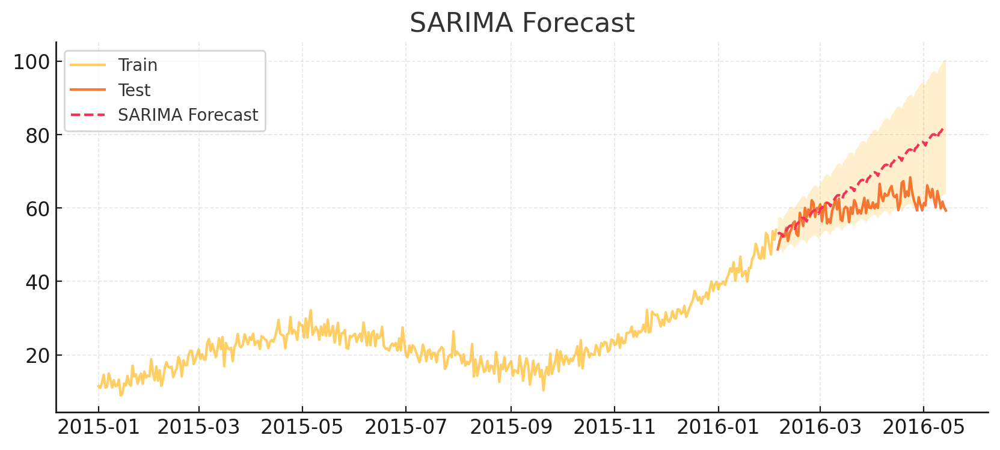

# 🌟 Advanced Time Series Forecasting with State-Space Models & Kalman Filtering

A complete end-to-end implementation of time-series forecasting using **State-Space Models**, **Kalman Filter**, **RTS Smoothing**, **EM Algorithm**, and **SARIMA** — with full diagnostics, visualizations, and benchmarking.

---

## 📚 Table of Contents
- [Overview](#overview)
- [Features](#features)
- [Dataset](#dataset)
- [Project Structure](#project-structure)
- [Methodology](#methodology)
- [Results](#results)
- [How to Run](#how-to-run)
- [Reports & Visuals](#reports--visuals)
- [Conclusion](#conclusion)
- [Contact](#contact)

---

## 🔍 Overview

This project implements multiple forecasting models to analyze and predict daily time-series data exhibiting trend and weekly seasonality.

The workflow includes:
- Data preprocessing  
- State-space formulation  
- Kalman filtering  
- RTS smoothing  
- EM learning  
- SARIMA baseline  
- Forecasting evaluation  
- Diagnostics & PDF reporting  

---

## ✨ Features
✔ Time-series dataset cleaning  
✔ Custom State-Space Model  
✔ Kalman Filter  
✔ RTS Smoother  
✔ EM algorithm  
✔ SARIMA baseline  
✔ Visualizations & reports  
✔ Train-test split and metrics  

---

## 📊 Dataset
- 500 daily observations  
- Trend + weekly seasonality  
- Cleaned (no missing values)  
- Train: 400  
- Test: 100  

---

## 🗂 Project Structure
```
complete_project/
│
├── data/
│     └── time_series_dataset.csv
├── notebooks/
│     └── TimeSeries_StateSpace_Project_upload.ipynb

├── src/
│     ├── kalman_filter.py
│     ├── state_space_model.py
│     ├── em_estimator.py
│     ├── sarima_baseline.py
│     └── utils.py
├── results/
│     ├── raw_timeseries_plot.png
│     ├── final_report.pdf
└── README.md
```

---

## 🧠 Methodology

### 1. State-Space Model
```
x_t = F x_{t-1} + w_t
y_t = H x_t + v_t
```

### 2. Kalman Filter  
Performs prediction + correction steps.

### 3. RTS Smoother  
Refines KF estimates backward in time.

### 4. EM Algorithm  
Used to learn Q, R noise matrices.

### 5. SARIMA Baseline  
Model used: `SARIMA(1,1,1)(1,1,1)[7]`

---

## 📈 Results

| Model | MAE | RMSE | MAPE | Notes |
|------|-----|------|------|-------|
| Kalman Filter | 21.19 | 25.13 | 34.60% | Good structure |
| UC (MLE) | 13.78 | 16.98 | 22.48% | Stable baseline |
| EM-KF | Diverged | Diverged | Diverged | EM unstable |
| **SARIMA** | **7.53** | **9.54** | **12.34%** | ⭐ Best |

---

## ▶️ How to Run

### Notebook
```
notebooks/TimeSeries_StateSpace_Project.ipynb
```

### Script version
```
python src/main.py
```

---

## 🖼 Reports & Visuals
All plots + final PDF located in:
```
results/
## 🖼️ Sample Forecast Visuals

### 📌 Combined Forecast


### 📌 SARIMA Forecast


### 📌 UC Forecast


```

---

## 🏁 Conclusion
This project demonstrates:
- State-space modelling  
- Kalman filtering  
- EM optimization  
- SARIMA benchmarking  
- Full forecasting pipeline  

---

## 📬 Contact
**Author:** Jessi  
GitHub: https://github.com/anithajessi12-sudo
